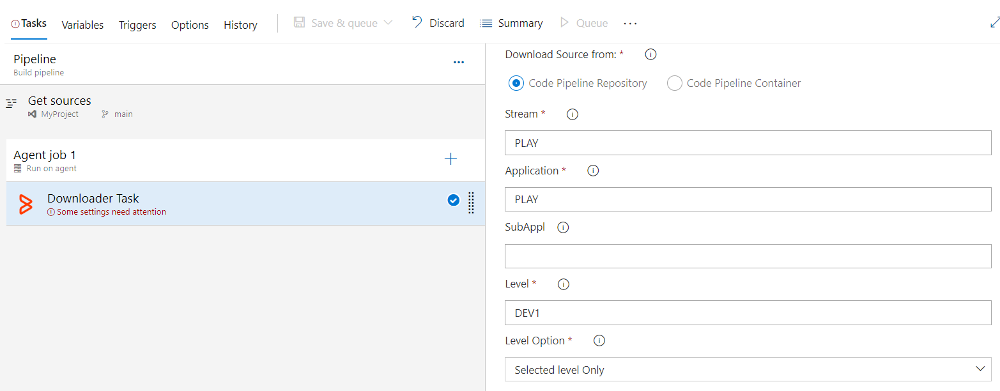

# BMC ISPW Source Code Downloader

## Overview

The BMC ISPW Source Code Downloader extension allows users to download ISPW members from the mainframe to the PC. Source can then be accessed on the PC, for example, for SonarQube analysis and reporting.

## Prerequisites

The following are required to use this plugin:
- Azure Cloud or On Premise Azure DevOps Server.
- [Azure Pipelines agents](https://learn.microsoft.com/en-us/azure/devops/pipelines/agents/agents?view=azure-devops&tabs=browser): Self Hosted Agents setup on which Topaz WorkBench CLI will be installed. 
- [BMC Common Configuration](https://marketplace.visualstudio.com/items?itemName=BMC.common-config-extension) Azure extension.
- Topaz Workbench CLI.
- Host Communications Interface.
.

## Installing extensions in a Azure Devops Server Instance

1. Install the BMC common configuration extension and BMC ISPW Source Code Downloader extension according to the Azure Devops instructions for installing extensions. 
2. Install the Topaz Workbench CLI on the machine in which Azure Devops Server is running that will execute the extension. The Topaz Workbench CLI is available in the Topaz Workbench installation package. If you do not have the installation package, please visit [support.bmc.com](https://support.bmc.com/). 

## Configuring for Topaz Workbench CLI & Host Connections

In order to download ISPW members you will need to point to an installed Topaz Workbench Command Line Interface (CLI). The Topaz Workbench CLI will work with host connection(s) you also need to configure to download ISPW members.

### Downloading ISPW Container members

This integration allows downloading of ISPW Container members from the mainframe to the PC.

While creating the new Azure pipeline, we can add a new task "BMC ISPW Source Downloader" by clicking + sign on Agent Job. 

This BMC ISPW Source Downloader task has following parameters:

- **Host connection** : Select the host connection to be used to connect to the z/OS host.

- Alternatively, to add a new connection, click on + New. The **Host connections** section of the Topaz Common configuration tab appears so a connection can be added.

- **Runtime configuration** : Enter the host runtime configuration. To use the default configuration, leave the field blank.

- **ISPW User Id** : Select the ISPW user id to use for logging onto the z/OS host.

- **Password** : Instead of enteriend password directly in this field, In Azure we have azure vault for storing secrets. We can store password as Azure pipeline variable as a secret and use that variable in this field. Example $(variablename)

Do the following in the **Filter** section to identify ISPW members to be downloaded:

- **Container name** : Enter the name of the container to target for the download.

- **Container type** list (do one of the following):

     - **Assignment** : Select if the specified **Container name** is an assignment.
     - **Release** : Select if the specified **Container name** is a release.
     - **Set** : Select if the specified **Container name** is a set.

- **Level** : Optionally use to identify components at a specific level in the life cycle to download (such as DEV1, STG1, or PRD).
- **Component type** : Optionally use to identify components of a specific type to download (such as COB, COPY, or JOB).
- **Force download of unchanged source** : Optionally use to indicate that all source matching the current filter should be downloaded, regardless of whether it has been changed recently or not. If this box is left unchecked, it will delete any files in the workspace that no longer match the filter specified above. Leaving it unchecked will also only download source that has been changed since the last time the job was run.

Click **Save**.

Run the job, which by default the following occurs:
- Mainframe source is downloaded to the project's or job's workspace into an <ISPW Application name>/MF_Source folder.
- Folder components are downloaded into an <ISPW Application name> folder.

- Optionally, to perform SonarQube analysis, install the SonarQube extension and refer to the documentation for the SonarQube extenion.

### Downloading ISPW Repository members

This integration allows downloading of ISPW Repository members from the mainframe to the PC.

While creating the new Azure pipeline, we can add a new task "BMC ISPW Source Downloader" by clicking + sign on Agent Job. 

This BMC ISPW Source Downloader task has following parameters:

- **Host connection** : Select the host connection to be used to connect to the z/OS host.

Alternatively, to add a new connection, click on + New. The **Host connections** section of the Topaz Common configuration tab appears so a connection can be added.

- **Runtime configuration** : Enter the host runtime configuration. To use the default configuration, leave the field blank.

- **ISPW User Id** : Select the ISPW user id to use for logging onto the z/OS host.

- **Password** : Instead of enteriend password directly in this field, In Azure we have azure vault for storing secrets. We can store password as Azure pipeline variable as a secret and use that variable in this field. Example $(variablename)

Do the following in the **Filter** section to identify ISPW members to be downloaded:

- **Stream** : Enter the two- to eight-character code that defines the application structure with which the application is associated.
- **Application** : Enter the container's primary application code. Containers may include components from multiple applications.
- **Level** : Enter the life cycle level.
- **Level option** list (do one of the following):
     - **Selected level only** : Select to display only components at the selected life cycle level in the view.
     - **First found in level and above** : Select to display the first version found of each component at the selected level and above. In other words, if there are multiple versions in the life cycle, display one version of the component that is the first one found at the selected level and any levels in the path above it.
- **Component types** and/or **Application root folder names** : Optionally use to identify components and application root folders to download.
      - To download a folder that matches the name specified (and all of its contents) and download all components outside of a folder that match the specified type, enter values in both the **Component types** and **Application root folder names** fields. Enter in the **Component types** field the component type (such as COB, COPY, or JOB) on which to filter. Enter in the **Application root folder names** field the name of the folder on which to filter. For example, entering **COB** in the Component types field and **FolderX** in the **Application root folder names** field will download FolderX and all of its contents, as well as all of the COB files that exist outside of folders.
      - To download all components of a specified type regardless of whether they are within folders, use only the **Component types** field by entering the component type (such as COB, COPY, or JOB) on which to filter.
      - To download a folder that matches the name specified (and all of its contents), as well as all components that are not within a folder, use only the **Application root folder names** field by entering the name of the folder on which to filter.
      - To download all components and folders in the application and level selected, leave both fields empty.
      - To download multiple folders or types, comma-separate the values.
      - **Force download of unchanged source** : Optionally use to indicate that all source matching the current filter should be downloaded, regardless of whether it has been changed recently or not. If this box is left unchecked, it will delete any files in the workspace that no longer match the filter specified above. Leaving it unchecked will also only download source that has been changed since the last time the job was run.

Click **Save**.

Run the job, which by default the following occurs:
- Mainframe source is downloaded to the project's or job's workspace into an <ISPW Application name>/MF_Source folder.
- Folder components are downloaded into an <ISPW Application name> folder.

- Optionally, to perform SonarQube analysis, install the SonarQube extnesion and refer to the documentation for the SonarQube extension.

## Product Assistance

BMC provides assistance for customers with its documentation, the BMC Support Center web site, and telephone customer support.

### BMC Support Center

You can access online information for BMC products via our Support Center site at [https://support.bmc.com](https://support.bmc.com/). Support Center provides access to critical information about your BMC products. You can review frequently asked questions, read or download documentation, access product fixes, or e-mail your questions or comments. The first time you access Support Center, you must register and obtain a password. Registration is free.

### Contacting Customer Support

At BMC, we strive to make our products and documentation the best in the industry. Feedback from our customers helps us maintain our quality standards. If you need support services, please obtain the following information before calling BMC\'s 24-hour telephone support:

- The Azure pipeline job output that contains any error messages or pertinent information.

- The name, release number, and build number of your product. This information is displayed in the installed extensions page. Apply filter: BMC in order to display all of the installed BMC extension.

- Environment information, such as the operating system and release on which the Topaz CLI is installed.

You can contact BMC in one of the following ways:

#### Web

You can report issues via BMC Support Center: [https://support.bmc.com](https://support.bmc.com/).

Note: Please report all high-priority issues by phone.

### Corporate Web Site

To access BMC site on the Web, go to [https://www.bmc.com/](https://www.bmc.com/). The BMC site provides a variety of product and support information.
